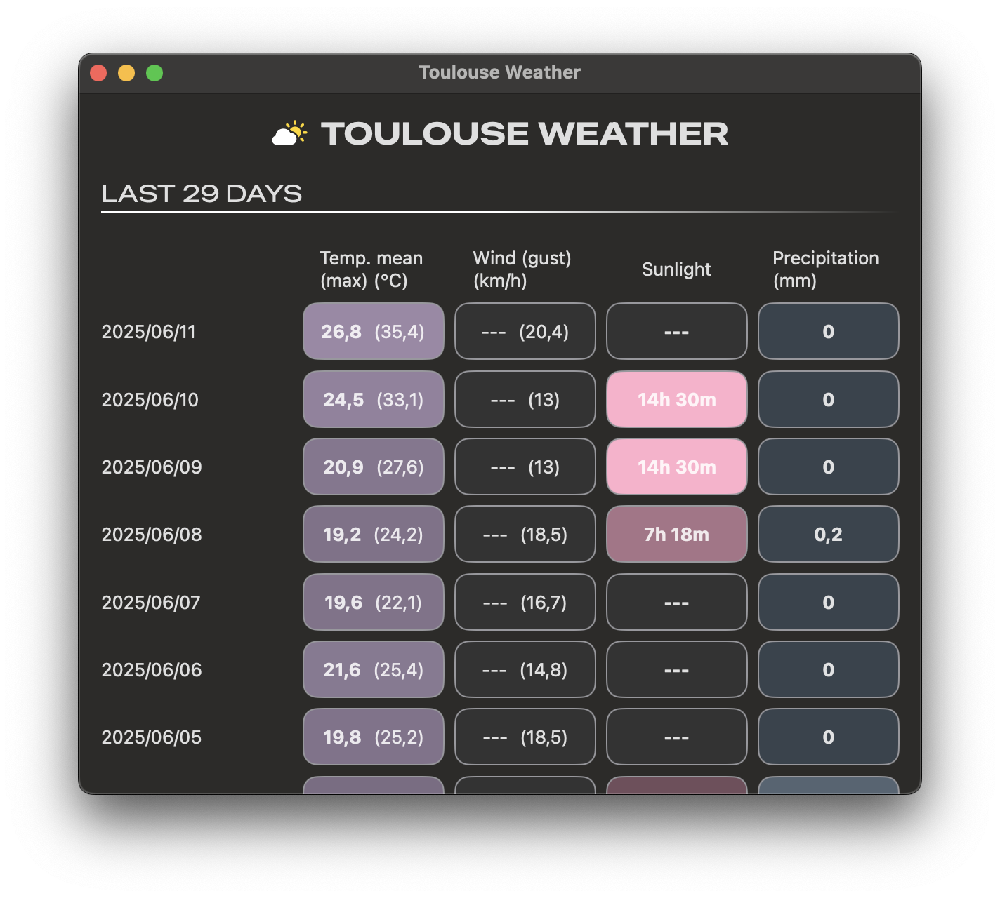
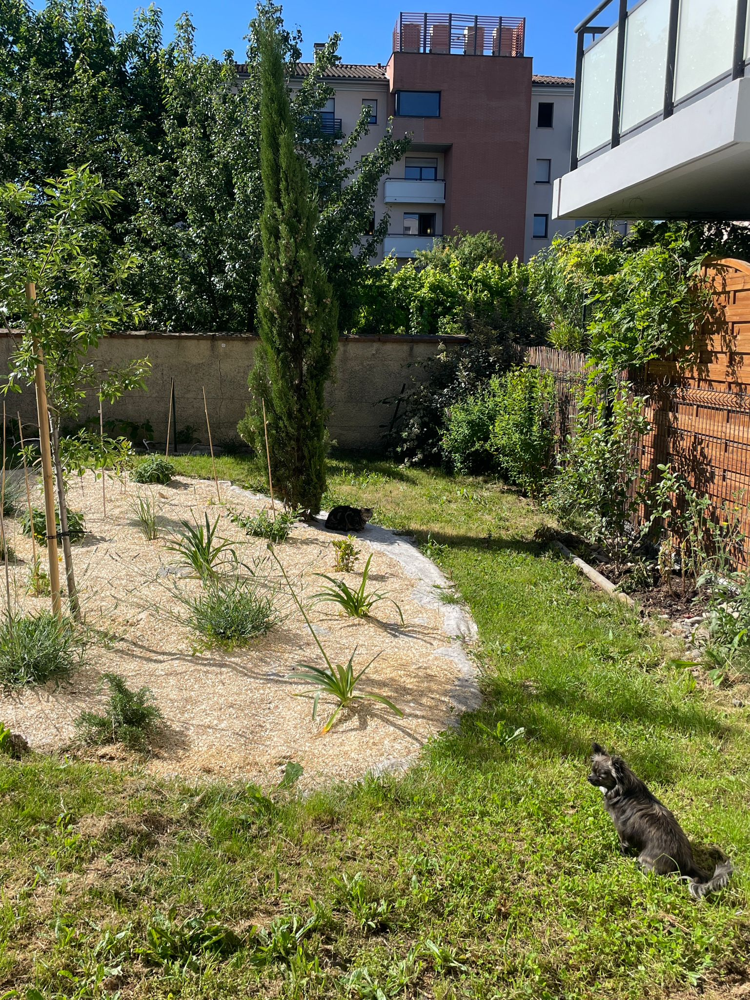

# Toulouse Daily Climate 🌤️

## 🦫 Long story short...

At last, we have a pretty garden with flowers and trees in the residence, but the plants are young and need attention.

My first thought was to use [Toulouse Métropole's Open Data](https://data.toulouse-metropole.fr/pages/accueil/). However, the data is partial or buggy...

I'm particularly interested in rainfall, so I was disappointed to see that the value was always 0, even on rainy days...

Here are a few examples:

- https://data.toulouse-metropole.fr/explore/dataset/03-station-meteo-toulouse-busca/
- https://data.toulouse-metropole.fr/explore/dataset/38-station-meteo-toulouse-parc-jardin-des-plantes/

In the end, I opted for ... scraping ... but to avoid making more calls than necessary, I store the data.

I can retrieve as many days as I want. The application will retrieve all the necessary pages, scrape the data, store it and then display it.

The data is incomplete here too, but it's good enough for my needs. The probe is also further away, but so far it seems consistent enough for me to observe whether the rainfall is sufficient, or whether we've had too many hot days without rain.

## 🌦️ The app

There are 4 types of information: temperature (average over the day and maximum), wind (average over the day and gusts), sunlight and precipitation (rainfall).

### 🕵️‍♂️ About the values:

- The average wind data are missing, but they are managed. The source does not provide it, but if one day the source is fixed, the application will handle this data correctly.
- I was able to observe missing values for sunshine (missing on the source).

### 🏗️ About the architecture:

- There are 2 services, one to scrape the data ([`WebScraperService`](https://github.com/ipefixe/Toulouse-Daily-Climate/blob/main/Toulouse%20Weather/Services/WebScraperService.swift)), and a second one to persist these data ([`PersistentService`](https://github.com/ipefixe/Toulouse-Daily-Climate/blob/main/Toulouse%20Weather/Services/PersistentService.swift)).
- There are 3 levels of model:
  - a DTO (Data Transfer Object) created by the WebScraperService
  - a model whose purpose is to be persisted
  - a ViewData model to be displayed

ℹ️ Yes, it's overkilled for this project, but I intended to make the application with a proper division of responsibilities.

- The view part is done in SwiftUI. I've splitted the views into smaller views and components.

### ☄️ And of course, about the climate:

Yes, on June 11th we had an average temperature of **26.8°C**. Whereas over the [period 1990-2020](https://fr.wikipedia.org/wiki/Climat_de_la_Haute-Garonne#Région_toulousaine_et_Lauragais), the average temperature is **20.5°C**. As I write this README, another week of temperatures of this order is forecast.

## ✅ TODO

🔲 Unit tests  
🔲 A retryer?  
🔲 Better persistence management, so that unnecessary pages are not called when data is missing that is not on that page

Dog tax 🐾

